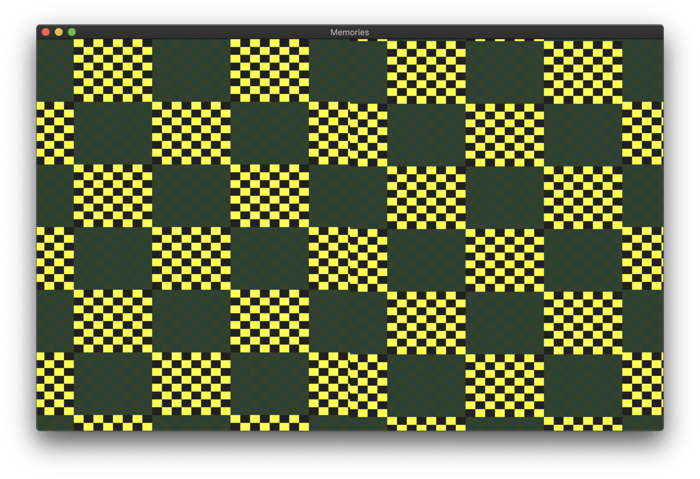
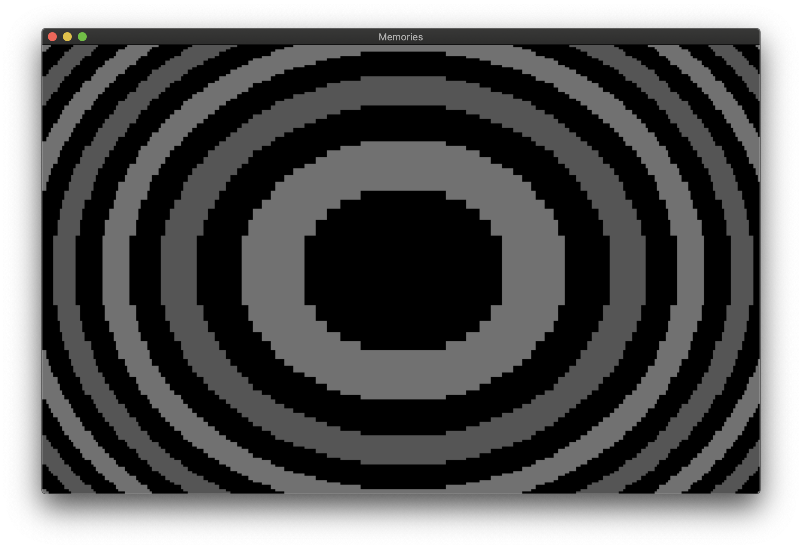
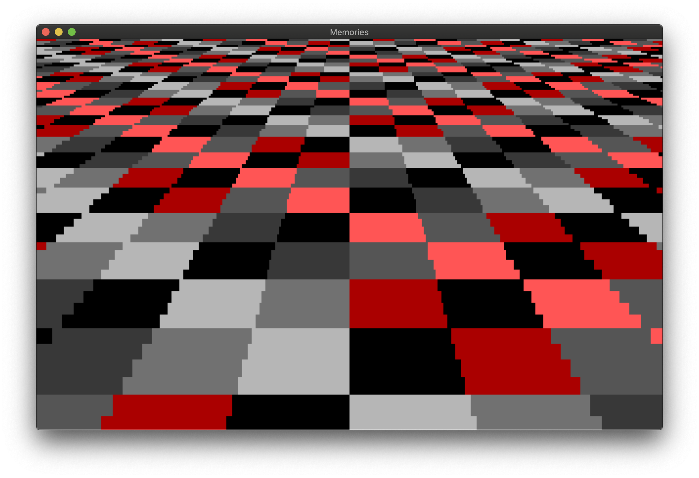
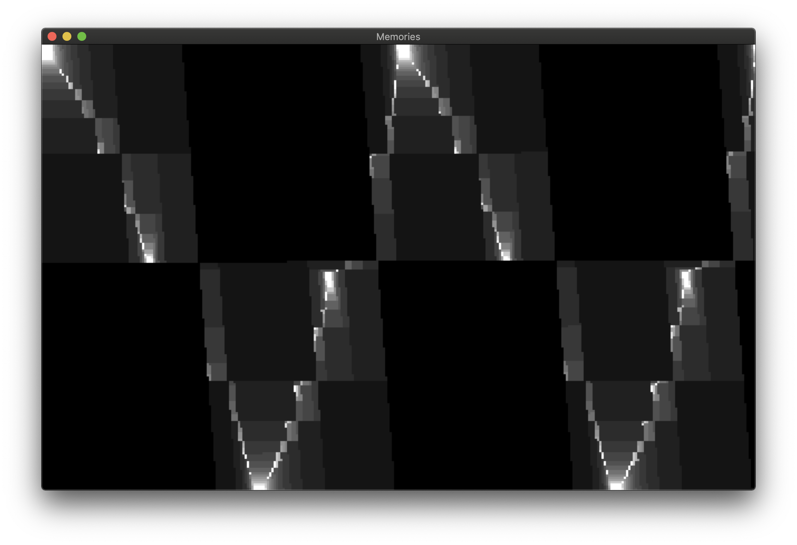
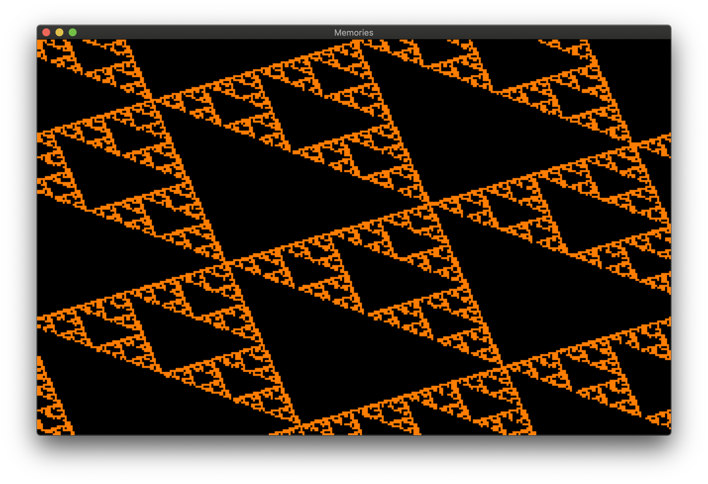
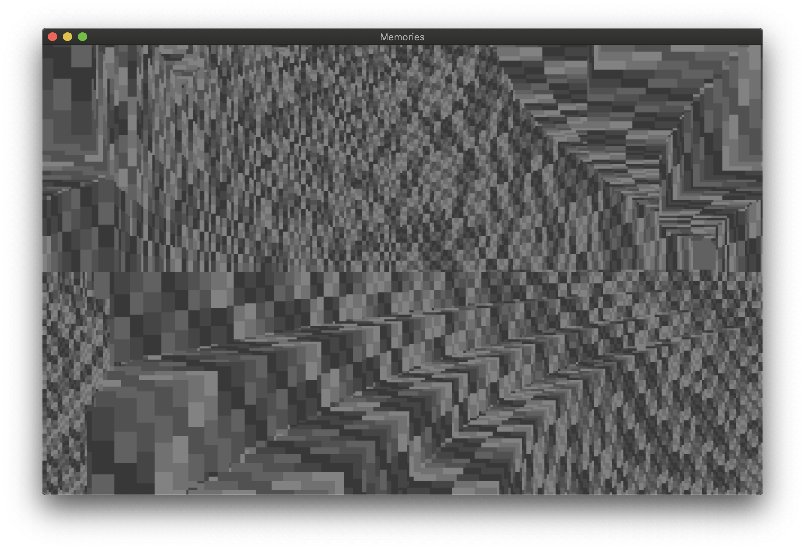
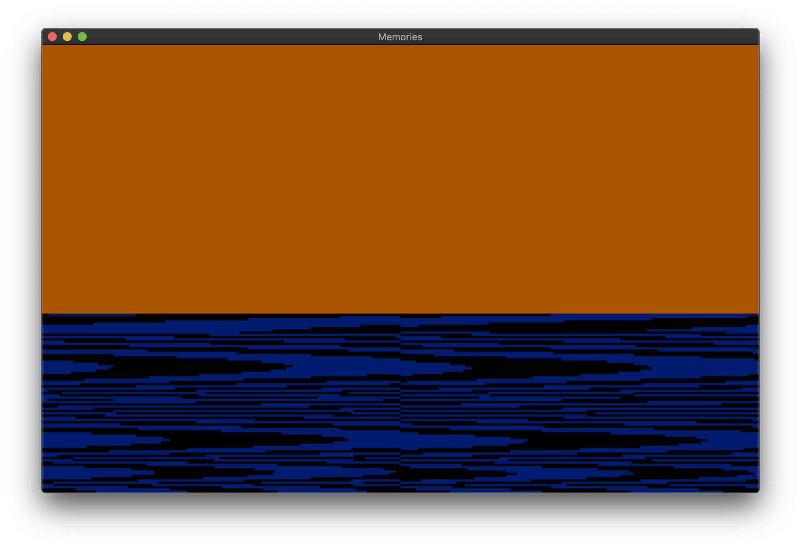

# cocoamemories
Pseudo-assembly replica of the "memories" 256 byte demo

This is a project to study the mechanisms used in [memories](https://www.pouet.net/prod.php?which=85227), a massively impressive 256 byte demo by Desire.

In such a tight size limit, being able to cram in 7 separate effects, a "script" to determine the sequence, a music player, and even make it visually appeasing is an incredible feat. But it also offered a great chance to study the internal mechanics of the x86 instruction set, so I created this project to start off with a safe playground on a modern machine and be able to play around with the instructions in a modern IDE without crashing an emulator instance.

The [main.m](cocoamemories/main.m) file has a simple runloop that sets up a draw surface with [TIGR](https://bitbucket.org/rmitton/tigr/overview). TIGR supports Mac and Windows, but the repo currently only has an xcode project. You can probably compile this for windows by just stuffing all the files in a VS project and hitting build.

[mainloop.c](cocoamemories/mainloop.c) contains the somewhat untouched assembly logic of the demo, converted into using fake CPU registers in C. Straight C has been used to implement the instructions where it seemed easy, and special functions mimicing the rest are in place for the rest.

All the original x86 assembly code with a really awesome writeup on each effect can be found at http://www.sizecoding.org/wiki/Memories

There's also a nice breakdown of some of the effects (with really cool visualizations too) at https://github.com/cesarmiquel/memories-256b-msdos-intro

This is considered a "fun" project so feel free to do whatever you like with any of the code.

## Not yet implemented

* Music playback

## Screenshots

