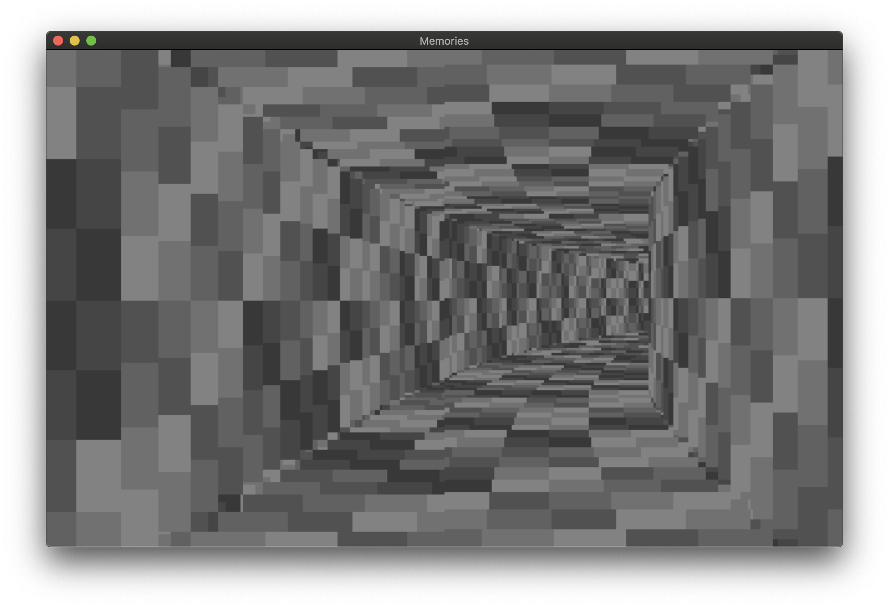

# cocoamemories
Pseudo-assembly replica of the "memories" 256 byte demo

This is a project to study the mechanisms used in [memories](https://www.pouet.net/prod.php?which=85227), a massively impressive 256 byte demo by Desire.

In such a tight size limit, being able to cram in 7 separate effects, a "script" to determine the sequence, a music player, and even make it visually appeasing is an incredible feat. But it also offered a great chance to study the internal mechanics of the x86 instruction set, so I created this project to start off with a safe playground on a modern machine and be able to play around with the instructions in a modern IDE without crashing an emulator instance.

The main.c file has a simple runloop that sets up a draw surface with TIGR. TIGR supports Mac and Windows, but the repo currently only has a n xcode project. You can probably compile this for windows by just stuffing all the files in a VS project and hitting build.

All the original x86 assembly code with a really awesome writeup on each effect can be found at http://www.sizecoding.org/wiki/Memories

This is considered a "fun" project so feel free to do whatever you like with any of the code. It's not 100% working yet either - there's a weird byte sign patch in place to get the X coordinate in properly, probably due to some error in the mul16 implementation.

## Screenshots

